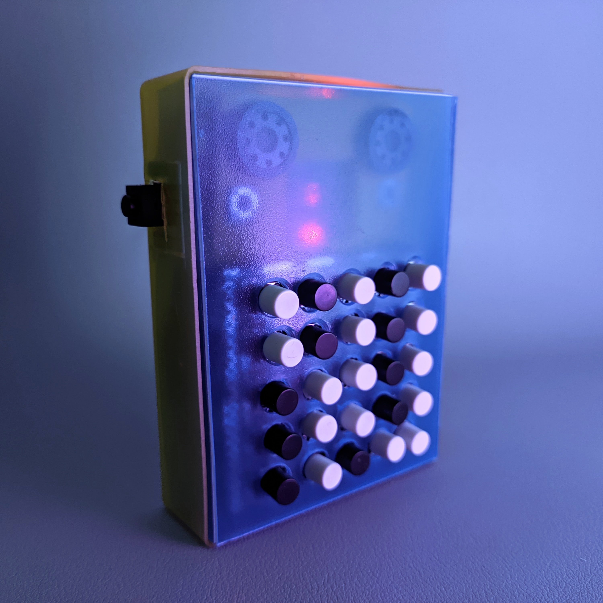
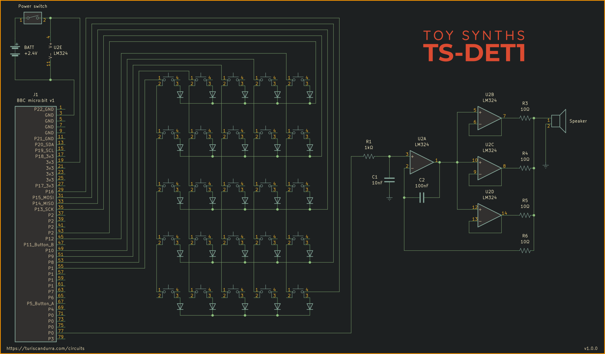

# TS-DET1
## micro:bit toy synth with 5x5 keypad and detuning

A quirky musical toy that detects and displays tilting while using such input to alter the pitch of the notes being played.
Works best in combination with a power amplifier and a low-pass filter.

### Schematic

Written for Arduino Nano or Arduino Uno.

Project info at [turiscandurra.com/circuits](https://turiscandurra.com/circuits)